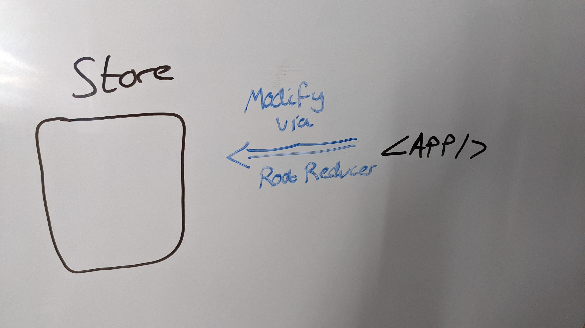
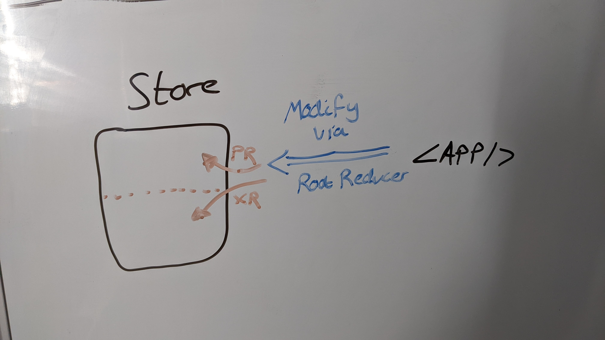
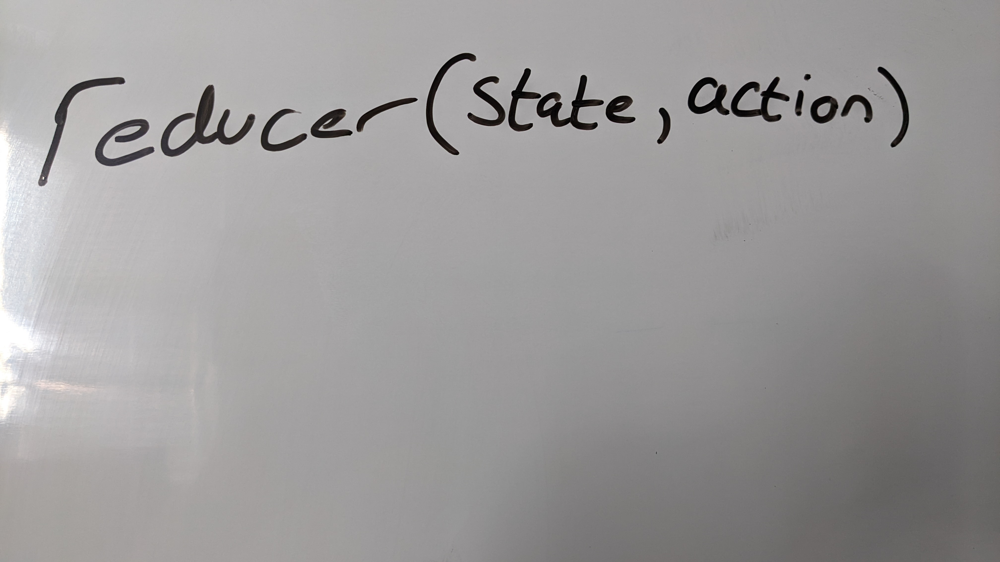
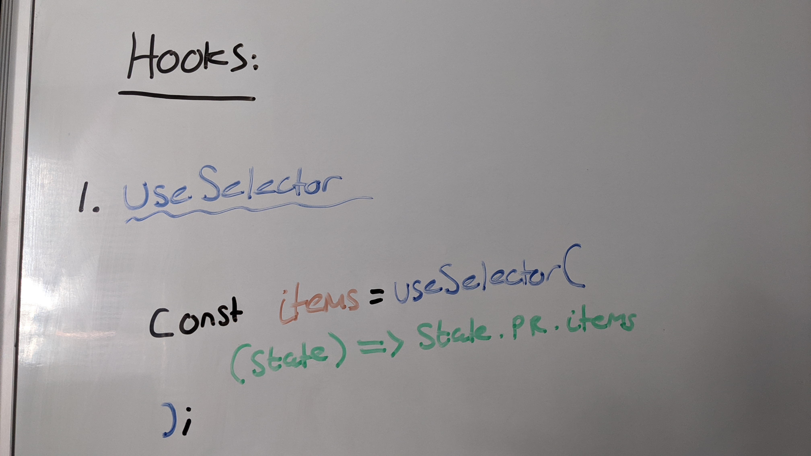

# redux-filter-example

This repo is a sample to aid the ldn8-horizon team complete their project, by showcasing an example of how would could use redux to enable filtering.

## Redux Explanation

### Store

Redux is store-based, meaning application state can be stored in a blob called the _store_. We pass this `store` to the `<Provider>` tag, and wrap our application with this. This means that our application has access to the `store`.

In order to protect how we interact with the store, we limit the way we can modify the state of the store by using **reducers**. A `reducer` is just a function which allows us to modify the data in the store. When we configure our `store`, we need to pass it a `reducer` as this will be our entry point for changing the store; we often call this reducer the `rootReducer`.

As our application grows, the capabilities of the `rootReducer` can grow very large. In order to add some structure to our store, we can split our `rootReducer` into separate reducers, each responsible for some `state` of the store (effectively splitting the store into smaller sections). For example, our `rootReducer` can be split into a `programsReducer` which can have some `state` (e.g. `{programs: Program[], selectedProgram: Program, user: string}`), and another reducer (e.g. the `XReducer` in the diagram below). We do this via the `combineReducers` function in Redux.

### Reducers

A `reducer` is a function which takes 2 parameters: the current `state` which that reducer is responsible for, and an `action` (see below for **actions**).

Reducers then often contain a `switch` statement which will perform some logic based on the action's `type`. Each `case` must `return` the _new_ state of the store (often done via spreading the current `state` into a new object, then updating the relevant property based on the action). Importantly, the `switch` statement requires a `default` case which returns the current state. This is because actions are sent to all reducers when `dispatch` is used (see below), and so they need to be able to handle actions they don't care about.

### Actions

An `action` is simple a JS object with 2 properties:

- `type`: A string-constant which identifies the action _uniquely_
- `payload`: An _optional_ property which contains data needed for the action (e.g. details of an `item` when adding to the cart via the `ADD_TO_CART` type).

Action `type`s are literally just strings. We use `const` and use SCREAM*CASE to denote that they are \_global* constants, as each action `type` **must** be globally unique.

### Using the Redux Store

There are 2 primary methods of interacting with the store (getting information from it, and passing actions to reducers to modify the store):

- Hooks
- Connect

#### Hooks

In order to get data from the store, we can use the `useSelector` hook. We pass this hook a _selector_, which is a function which takes the current `state` of the store, and returns the relevant section we want access to.

In order to modify data in our store, we use the `useDispatch` hook to get access to the `dispatch` function. `dispatch` is called with an action, and will pass that action to all the reducers in our application (which will then perform the logic to update the store accordingly).

#### Connect

A different (older) method of interacting with the store is via the `connect` function, which will pass the necessary state and actions to a react component for us, putting them in the component's `props`. This means we do not need to put selector/dispatch logic in our component, instead hiding it away into the `mapStateToProps` function (MSTP), and `mapDispatchToProps` function (MDTP).

`mapStateToProps` is roughly equivalent to `useSelector`, in that it allows us to access data in our store. This is a function which takes in the `state` of the store, and returns an object containing the values we need assigned to various keys. These keys are then accessible in our component's `props`.

`mapDispatchToProps` is roughly equivalent to `useDispatch`, in that it allows us to send actions to reducers. This is a function which takes in the `dispatch` function, and returns an object containing keys which correspond to functions which make use of the `dispatch` function. These functions are then placed into `props`, and can be called to dispatch the action specified in the MDTP function.

